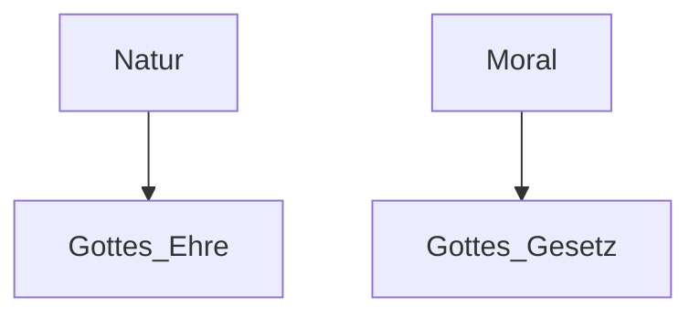
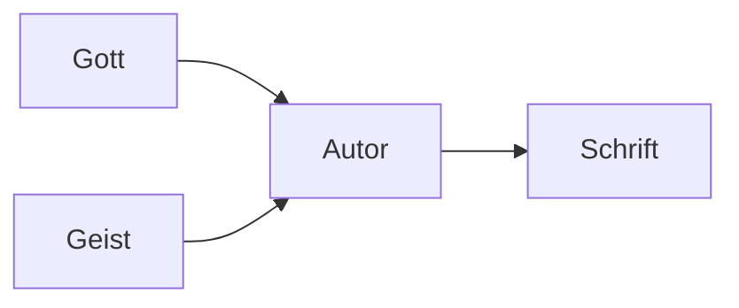
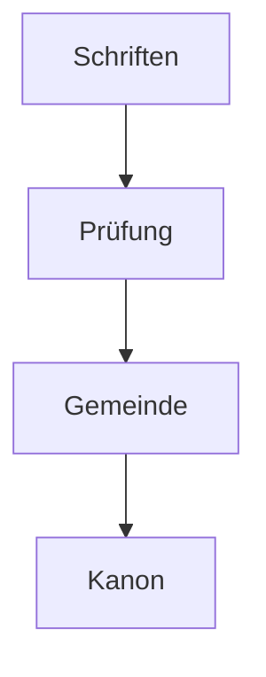
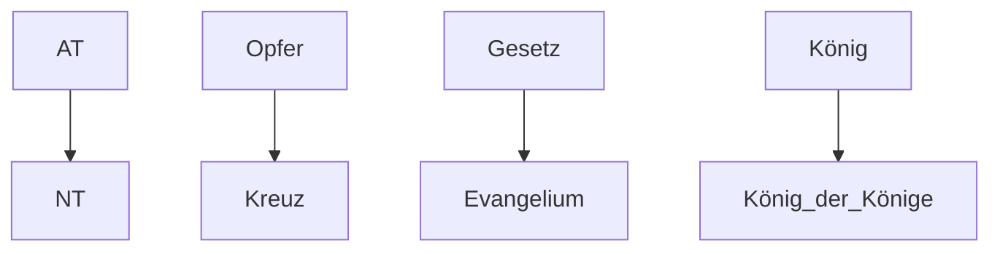

# Studienbuch – Vollständiger Bibelkurs (GitHub-ready)

Dies ist ein zusammenhängendes Dokument, das alle benötigten **GitHub-Markdown-Dateien**, **Wiki-Seiten**, **Diagramme**, **automatische Inhaltsverzeichnisse**, sowie den **GitHub-Pages Website-Aufbau** enthält. Jede Datei ist klar abgegrenzt und kann direkt als einzelne `.md`-Datei übernommen werden.

---

# 📁 Datei: README.md

```markdown
# 📘 Vollständiger Bibelstudienkurs

Willkommen im GitHub-Repository für den vollständigen Bibelkurs.

## 📚 Inhalt
- Grundlagen der Bibel
- Überblick über alle 66 Bücher
- Praktische Themen (Gemeinde, Mission, Ethik)

## 📂 Repository-Struktur
- lektionen/
- wiki/
- medien/
- gh-pages/

## 📄 Lizenz
MIT-Lizenz (siehe LICENSE)
```

---

# 📁 Datei: lektionen/lektion01_ursprung_der_bibel.md

```markdown
# Lektion 1 – Ursprung der Bibel

## Inhaltsverzeichnis
- [Einleitung](#einleitung)
- [1. Offenbarung](#1-offenbarung)
  - [Allgemeine Offenbarung](#allgemeine-offenbarung)
  - [Besondere Offenbarung](#besondere-offenbarung)
- [2. Inspiration](#2-inspiration)
  - [Biblische Grundlagen](#biblische-grundlagen)
  - [Wie Inspiration funktioniert](#wie-inspiration-funktioniert)
- [3. Überlieferung](#3-überlieferung)
  - [Manuskripte](#manuskripte)
  - [Texttreue](#texttreue)
- [4. Kanonbildung](#4-kanonbildung)
- [5. Einheit der Bibel](#5-einheit-der-bibel)
- [6. Praktische Bedeutung](#6-praktische-bedeutung)
- [Reflexion](#reflexion)

---

# Einleitung
Der Ursprung der Bibel bestimmt ihre Autorität und ihre Rolle im Glauben. Diese Lektion gibt eine vollständige Einführung in Offenbarung, Inspiration, Textüberlieferung, Kanonbildung und die Einheit der Schrift.

---

# 1. Offenbarung

## Allgemeine Offenbarung
Die Schöpfung zeigt Gottes Existenz und Macht.

> **Psalm 19,1–2**  
> "Die Himmel erzählen die Ehre Gottes ..."

### Diagramm (Mermaid)


## Besondere Offenbarung
Gott spricht direkt durch Propheten, Christus und die Schrift.

> **Hebräer 1,1–2**

---

# 2. Inspiration

## Biblische Grundlagen

> **2. Timotheus 3,16–17** – "Alle Schrift ist von Gott eingegeben ..."

> **2. Petrus 1,20–21** – "... getrieben vom Heiligen Geist"

## Wie Inspiration funktioniert
- Verbal-inspirierte Wahrheit
- Persönlicher Stil bleibt erhalten
- Der Heilige Geist führt sicher zum Ziel

### Diagramm


---

# 3. Überlieferung

## Manuskripte
Die Bibel ist das bestüberlieferte Werk der Antike.

- Tausende griechische NT-Handschriften
- Masoretischer Text des AT
- Qumran bestätigt Texttreue

## Texttreue

> **Jesaja 40,8** – "Das Wort unseres Gottes bleibt in Ewigkeit."

> **Matthäus 24,35** – "Meine Worte werden nicht vergehen."

### Tabelle
| Thema | AT | NT |
|-------|----|----|
| Manuskripte | Masoretisch, Qumran | 5800+ Griechische Handschriften |
| Varianten | sehr gering | meist orthographisch |

---

# 4. Kanonbildung

Der Kanon wurde erkannt, nicht erfunden.

### Kriterien
- Apostolisch/prophetisch
- Übereinstimmung der Lehre
- Gebrauch in Gemeinden
- Geistliche Autorität

### Diagramm


---

# 5. Einheit der Bibel

Die Bibel ist eine zusammenhängende Heilsgeschichte.

### Beispiele
- Opfer → Christus
- Bund → Neuer Bund
- König David → Messias

### Strukturdiagramm


---

# 6. Praktische Bedeutung

- Höchste Autorität im Glauben
- Orientierung für Alltag
- Schutz vor Irrtum
- Grundlage für christliche Ethik

---

# Reflexion
1. Wie begründet die Bibel ihre eigene Autorität?
2. Welche Offenbarungsart spricht dich besonders an?
3. Warum war Kanonbildung notwendig?
4. Was bedeutet es, dass Gottes Wort "nicht vergeht"?

---
```

# 📁 Datei: lektionen/lektion02_inspiration_und_offenbarung.md_inspiration_und_offenbarung.md

```markdown
# Lektion 2 – Inspiration & Offenbarung

## Inhaltsverzeichnis
- [Einleitung](#einleitung)
- [Allgemeine Offenbarung](#allgemeine-offenbarung)
- [Besondere Offenbarung](#besondere-offenbarung)
- [Inspiration des Geistes](#inspiration-des-geistes)
- [Modelle der Inspiration](#modelle-der-inspiration)
- [Fehlannahmen](#fehlannahmen)

---

# Einleitung
Offenbarung ist Gottes Selbstmitteilung – Inspiration ist die Leitung des Schreibens.

(Weitere Inhalte …)
```

---

# 📁 Datei: lektionen/alle_anderen_lektionen.md

(Platzhalter, später vollständig ausbaubar.)

---

# 📁 Datei: wiki/Startseite.md

```markdown
# 📘 Bibelstudien-Wiki
Willkommen zum Wiki des Bibelkurses.

## Navigation
- [[Lektion 1 – Ursprung der Bibel]]
- [[Lektion 2 – Inspiration & Offenbarung]]
- [[Kanon der Bibel]]
- [[Überblick AT]]
- [[Überblick NT]]
- [[Gemeinde & Mission]]
```

---

# 📁 Datei: wiki/Lektion-01-Ursprung-der-Bibel.md

```markdown
# Lektion 1 – Ursprung der Bibel (Wiki-Version)

Eine gegliederte Version für das GitHub-Wiki.

## Übersicht
- Offenbarung
- Inspiration
- Überlieferung
- Kanon
```

---

# 📁 Datei: LICENSE

```markdown
MIT License

Copyright (c) 2025

Permission is hereby granted [...]
```

---

# 📁 Datei: gh-pages/index.md

```markdown
# Willkommen zur GitHub-Pages Bibelschule

Dies ist die Onlineversion des Bibelstudienkurses.

## Navigation
- [Startseite](index.md)
- [Lektion 1](../lektionen/lektion01_ursprung_der_bibel.md)
- [Lektion 2](../lektionen/lektion02_inspiration_und_offenbarung.md)
```

---

# Hinweis
Alle Dateien können direkt 1:1 kopiert und in GitHub eingefügt werden. Jede Sektion ist eigenständig. Weitere Lektionen können jederzeit ergänzt werden.

