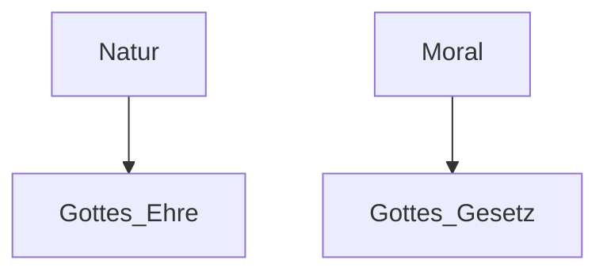
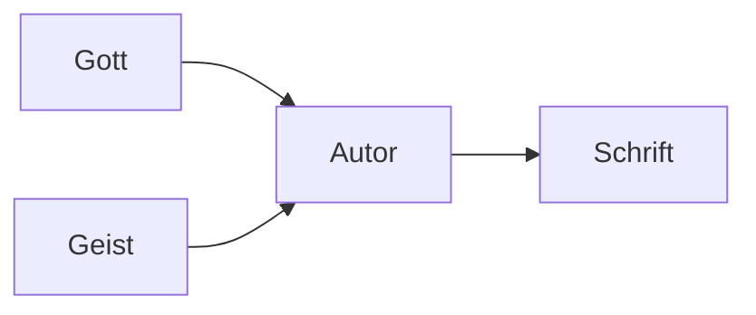
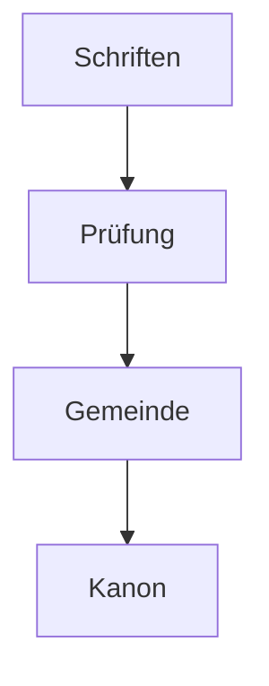
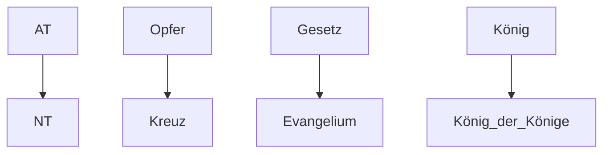
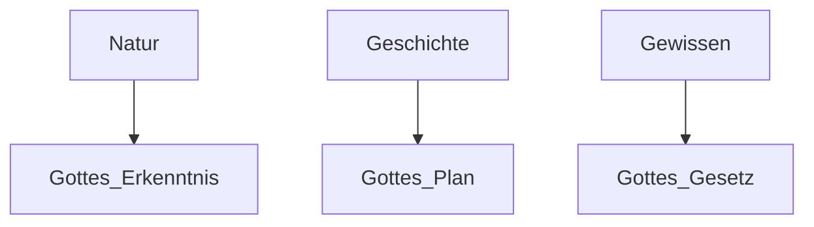
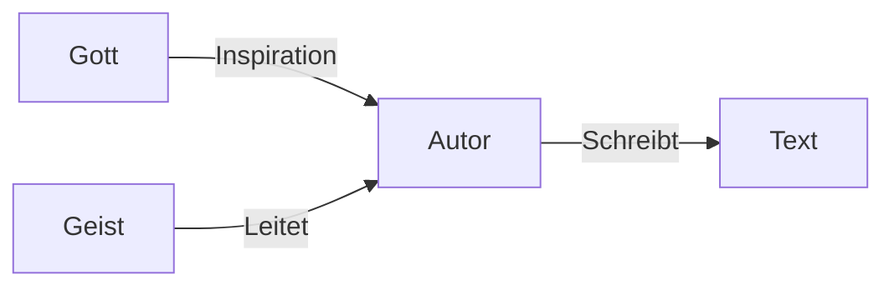

# Studienbuch – Vollständiger Bibelkurs (GitHub-ready)

Dies ist ein zusammenhängendes Dokument, das alle benötigten **GitHub-Markdown-Dateien**, **Wiki-Seiten**, **Diagramme**, **automatische Inhaltsverzeichnisse**, sowie den **GitHub-Pages Website-Aufbau** enthält. Jede Datei ist klar abgegrenzt und kann direkt als einzelne `.md`-Datei übernommen werden.

---

# 📁 Datei: README.md

```markdown
# 📘 Vollständiger Bibelstudienkurs

Willkommen im GitHub-Repository für den vollständigen Bibelkurs.

## 📚 Inhalt
- Grundlagen der Bibel
- Überblick über alle 66 Bücher
- Praktische Themen (Gemeinde, Mission, Ethik)

## 📂 Repository-Struktur
- lektionen/
- wiki/
- medien/
- gh-pages/

## 📄 Lizenz
MIT-Lizenz (siehe LICENSE)
```

---

# 📁 Datei: lektionen/lektion01_ursprung_der_bibel.md

```markdown
# Lektion 1 – Ursprung der Bibel

## Inhaltsverzeichnis
- [Einleitung](#einleitung)
- [1. Offenbarung](#1-offenbarung)
  - [Allgemeine Offenbarung](#allgemeine-offenbarung)
  - [Besondere Offenbarung](#besondere-offenbarung)
- [2. Inspiration](#2-inspiration)
  - [Biblische Grundlagen](#biblische-grundlagen)
  - [Wie Inspiration funktioniert](#wie-inspiration-funktioniert)
- [3. Überlieferung](#3-überlieferung)
  - [Manuskripte](#manuskripte)
  - [Texttreue](#texttreue)
- [4. Kanonbildung](#4-kanonbildung)
- [5. Einheit der Bibel](#5-einheit-der-bibel)
- [6. Praktische Bedeutung](#6-praktische-bedeutung)
- [Reflexion](#reflexion)

---

# Einleitung

Die Themen *Offenbarung* und *Inspiration* gehören zu den tiefsten und anspruchsvollsten Bereichen der theologischen Wissenschaft. Sie berühren die Schnittstelle zwischen dem unendlichen Gott und dem endlichen Menschen. Während die gesamte Bibel von der Wirklichkeit spricht, dass Gott redet, stellt diese Lektion die entscheidenden Fragen, **wie** Gott redet, **warum** er redet, **auf welche Weise** dieses Reden den Menschen erreicht und wie es schließlich in der Heiligen Schrift dauerhaft Gestalt annimmt.

Offenbarung ist mehr als Information – sie ist die Selbstmitteilung Gottes. Sie zeigt nicht nur göttliche Wahrheit, sondern offenbart den Charakter, den Willen und die Absichten Gottes in Geschichte und Heilshandeln. Jede Form von Offenbarung ist daher ein Akt göttlicher Initiative: Gott bleibt nicht verborgen, sondern er tritt in Beziehung zum Menschen. Diese Beziehung ist nicht philosophisch-abstrakt, sondern ereignet sich real: in Natur, Gewissen, Geschichte, Prophetie und letztlich ganz konkret in Jesus Christus.

Inspiration wiederum ist der Prozess, durch den diese Offenbarung **zu einer verlässlichen, geordneten und dauerhaft gültigen schriftlichen Form** geführt wird. Hier treffen göttliche Autorität und menschliche Mitschrift aufeinander. Die Bibel ist nicht vom Himmel gefallen, und die Autoren waren keine unbewussten Werkzeuge, sondern Menschen mit Persönlichkeit, Stil, Kultur und Denkweise – und dennoch geleitet, bewahrt und getragen vom Heiligen Geist.

Diese doppelte Wirklichkeit – *Gott spricht* und *Gott lässt schreiben* – bildet das Fundament jeder biblischen Theologie. Wer die Bibel verstehen will, muss verstehen, wie göttliches Wort durch menschliche Worte hindurchgeht, ohne seine Wahrheit zu verlieren. Diese Lektion vermittelt daher:

- die Breite und Tiefe göttlicher Offenbarung,
- die Mechanismen und Modelle der Inspiration,
- das Zusammenspiel zwischen Gottes Wirken und menschlicher Verantwortung,
- und die Gründe, warum die Bibel als inspiriertes Wort Gottes volle Autorität besitzt.

Diese Einführung legt die notwendige Grundlage für alles weitere Bibelstudium. Jede spätere Lektion – über Kanon, Überlieferung, Exegese oder Dogmatik – steht und fällt mit einem klaren Verständnis darüber, **wie die Bibel zu dem wurde, was sie ist: Gottes zuverlässiges, wirkmächtiges und vertrauenswürdiges Wort.**


Der Ursprung der Bibel bestimmt ihre Autorität und ihre Rolle im Glauben. Diese Lektion gibt eine vollständige Einführung in Offenbarung, Inspiration, Textüberlieferung, Kanonbildung und die Einheit der Schrift.

---

# 1. Offenbarung

## Allgemeine Offenbarung
Die Schöpfung zeigt Gottes Existenz und Macht.

> **Psalm 19,1–2**  
> "Die Himmel erzählen die Ehre Gottes ..."

### Diagramm (Mermaid)


## Besondere Offenbarung
Gott spricht direkt durch Propheten, Christus und die Schrift.

> **Hebräer 1,1–2**

---

# 2. Inspiration

## Biblische Grundlagen

> **2. Timotheus 3,16–17** – "Alle Schrift ist von Gott eingegeben ..."

> **2. Petrus 1,20–21** – "... getrieben vom Heiligen Geist"

## Wie Inspiration funktioniert
- Verbal-inspirierte Wahrheit
- Persönlicher Stil bleibt erhalten
- Der Heilige Geist führt sicher zum Ziel

### Diagramm


---

# 3. Überlieferung

## Manuskripte
Die Bibel ist das bestüberlieferte Werk der Antike.

- Tausende griechische NT-Handschriften
- Masoretischer Text des AT
- Qumran bestätigt Texttreue

## Texttreue

> **Jesaja 40,8** – "Das Wort unseres Gottes bleibt in Ewigkeit."

> **Matthäus 24,35** – "Meine Worte werden nicht vergehen."

### Tabelle
| Thema | AT | NT |
|-------|----|----|
| Manuskripte | Masoretisch, Qumran | 5800+ Griechische Handschriften |
| Varianten | sehr gering | meist orthographisch |

---

# 4. Kanonbildung

Der Kanon wurde erkannt, nicht erfunden.

### Kriterien
- Apostolisch/prophetisch
- Übereinstimmung der Lehre
- Gebrauch in Gemeinden
- Geistliche Autorität

### Diagramm


---

# 5. Einheit der Bibel

Die Bibel ist eine zusammenhängende Heilsgeschichte.

### Beispiele
- Opfer → Christus
- Bund → Neuer Bund
- König David → Messias

### Strukturdiagramm


---

# 6. Praktische Bedeutung

- Höchste Autorität im Glauben
- Orientierung für Alltag
- Schutz vor Irrtum
- Grundlage für christliche Ethik

---

# Reflexion
1. Wie begründet die Bibel ihre eigene Autorität?
2. Welche Offenbarungsart spricht dich besonders an?
3. Warum war Kanonbildung notwendig?
4. Was bedeutet es, dass Gottes Wort "nicht vergeht"?

---
```

# 📁 Datei: lektionen/lektion02_inspiration_und_offenbarung.md

```markdown
# Lektion 2 – Inspiration & Offenbarung

## Inhaltsverzeichnis
- [Einleitung](#einleitung)
- [1. Grundlagen der Offenbarung](#1-grundlagen-der-offenbarung)
  - [Allgemeine Offenbarung](#allgemeine-offenbarung)
  - [Besondere Offenbarung](#besondere-offenbarung)
- [2. Inspiration](#2-inspiration)
  - [Definition & Bedeutung](#definition--bedeutung)
  - [Biblische Grundlagen](#biblische-grundlagen)
  - [Modelle der Inspiration](#modelle-der-inspiration)
  - [Wie Inspiration funktioniert](#wie-inspiration-funktioniert)
- [3. Beispiele der Inspiration in der Bibel](#3-beispiele-der-inspiration-in-der-bibel)
- [4. Fehlannahmen über Inspiration](#4-fehlannahmen-über-inspiration)
- [5. Wirkung der Inspiration](#5-wirkung-der-inspiration)
- [Reflexion](#reflexion)

---

# Einleitung
Diese Lektion vertieft die Themen Offenbarung und Inspiration. Offenbarung beschreibt *wie* Gott sich mitteilt; Inspiration beschreibt *wie* diese Mitteilung zuverlässig zur schriftlichen Bibel wurde.

---

# 1. Grundlagen der Offenbarung

## Allgemeine Offenbarung
Gott zeigt sich allen Menschen durch Natur, Geschichte und Gewissen.

> **Psalm 19,1–2** – „Die Himmel erzählen die Ehre Gottes …“
> **Römer 1,19–20** – Gottes unsichtbares Wesen wird "an den Werken" erkannt.

### Diagramm


## Besondere Offenbarung
Diese Offenbarung ist direkt, klar und heilbringend – sie macht Gottes Willen erkennbar.

Formen:
- Propheten
- Wunder
- Träume & Visionen
- Jesus Christus
- Schrift

> **Hebräer 1,1–2** – Gott sprach in den Propheten und im Sohn.

---

# 2. Inspiration

## Definition & Bedeutung
Inspiration bedeutet: *Gott leitete die biblischen Schreiber so, dass das Ergebnis Gottes Wort ist.*

Die Bibel ist also sowohl göttlich als auch menschlich.

## Biblische Grundlagen
- **2. Timotheus 3,16–17** – „Alle Schrift ist von Gott eingegeben.“
- **2. Petrus 1,20–21** – „Getrieben vom Heiligen Geist.“

## Modelle der Inspiration
- **Verbal-inspirierte Inspiration** – Worte selbst werden geführt
- **Dynamische Inspiration** – Gedanken werden geleitet
- **Organische Inspiration** – Gott wirkt durch Persönlichkeit des Autors

### Vergleichstabelle
| Modell | Schwerpunkt | Stärke | Schwäche |
|--------|-------------|--------|----------|
| Verbal | Worte | höchste Genauigkeit | wirkt mechanisch |
| Dynamisch | Gedanken | natürliche Sprache | weniger präzise |
| Organisch | Person + Geist | biblisch ausgewogen | komplex in der Erklärung |

## Wie Inspiration funktioniert
Gott übergeht die Persönlichkeiten nicht, sondern gebraucht sie.

### Diagramm


---

# 3. Beispiele der Inspiration in der Bibel

- **Mose** empfängt direkte Worte Gottes.
- **David** schreibt Psalmen unter geistlicher Leitung.
- **Jeremia** diktiert Baruch inspiriert.
- **Lukas** forscht historisch, doch unter Führung des Geistes.
- **Paulus** nutzt Logik, doch geführt vom Geist.

---

# 4. Fehlannahmen über Inspiration

### Irrtum: „Inspiration bedeutet mechanisches Diktat.“
**Korrektur:** Der Stil der Autoren bleibt klar erkennbar.

### Irrtum: „Nur die Ideen sind inspiriert.“
**Korrektur:** Die Bibel bezeugt *Worte* als inspiriert.

### Irrtum: „Inspiration gilt nur für geistliche Texte.“
**Korrektur:** Auch Geschichte, Chronik, Zahlen usw. sind inspiriert.

---

# 5. Wirkung der Inspiration
- Irrtumslosigkeit im ursprünglichen Text
- Einheit der Schrift
- Autorität der Bibel in allen Fragen des Glaubens
- Kraft zur Veränderung

> **Hebräer 4,12** – „Das Wort Gottes ist lebendig und wirksam.“

---

# Reflexion
1. Welche Offenbarungsart ist für dich besonders bedeutend?
2. Welches Inspirationsmodell erscheint dir am biblischsten?
3. Warum braucht ein inspiriertes Buch eine feststehende Autorität?
4. Wie würdest du Inspiration einem Außenstehenden erklären?

---
```

# 📁 Datei: lektionen/lektion02_inspiration_und_offenbarung.md
